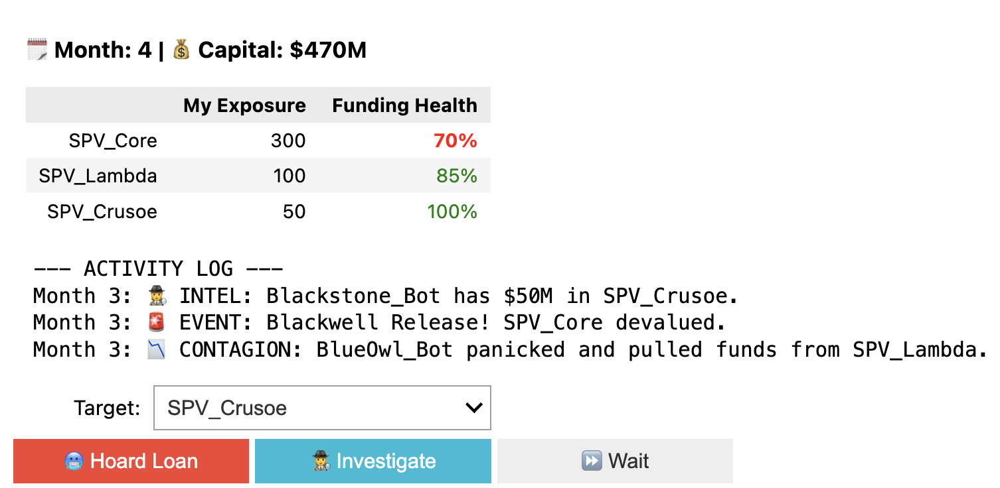
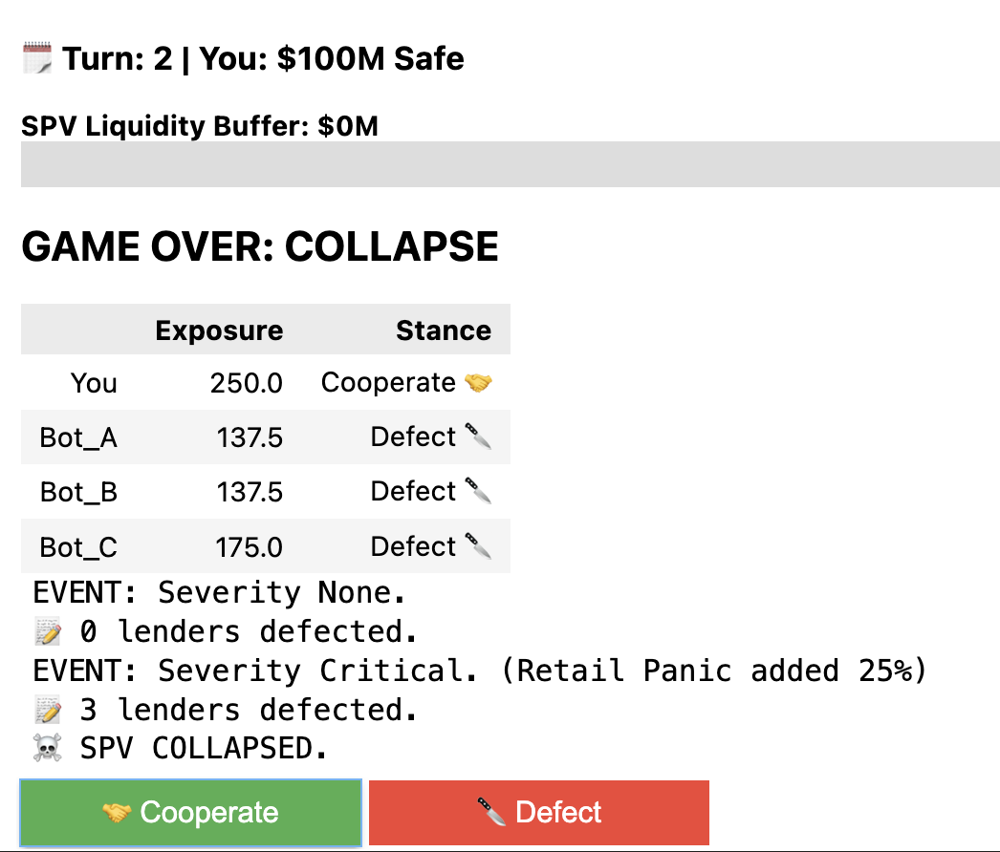
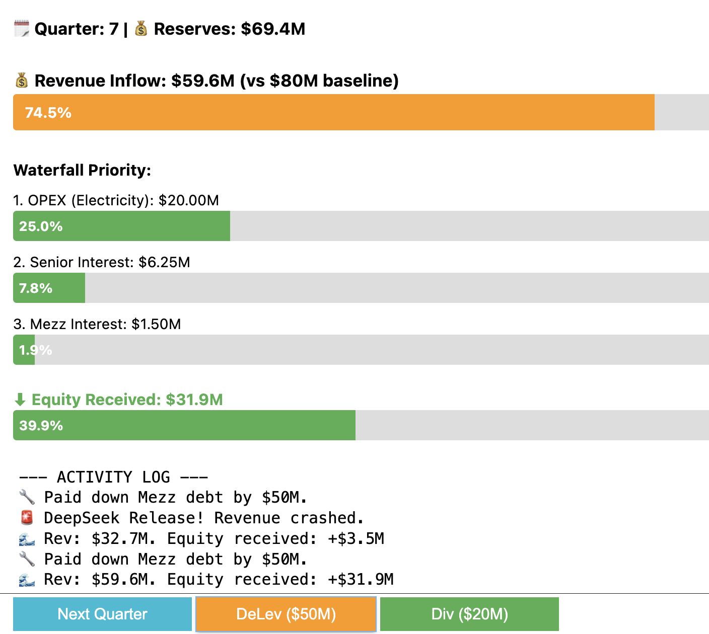

# Silicon Subprime: Simulation User Guide

This repository contains three interactive simulations designed to gamify the systemic risk factors of the AI "Compute" trade. Each game isolates specific variables of the "Four Ls" framework to demonstrate how structural fragility creates financial contagion.

---

## 🎮 Game 1: The Shadow Book
**Risk Focus:** *Linkages (L4)* & *Opacity*

---

---

### The Simulation
You play as a Chief Risk Officer managing a portfolio of loans to AI Service Providers (SPVs).
* **The Mechanic:** You can see your own exposure, but you cannot see the full "Cap Table" of your borrowers.
* **The Contagion:** If a "Whale" lender (e.g., a Bot representing Blackstone or Blue Owl) takes a loss on a different asset, they panic. To de-risk, they recall loans from *your* borrowers, draining liquidity even from healthy companies.

### The Real-World Analog
This simulates the **"Shadow Banking" Information Asymmetry** flagged by the Bank of England.
* **In Reality:** Private Credit markets are bilateral and opaque. A lender does not know if their borrower is cross-collateralized by another fund that is currently facing a liquidity crisis.
* **The Thesis Connection:** This proves that in a highly connected network, **diversification is an illusion.** If all lenders are exposed to the same vintage of H100 GPUs, a shock to one becomes a shock to all.

---

## 🎮 Game 2: The Syndicate
**Risk Focus:** *Liquidity (L3)* & *Retail Reflexivity (L2.5)*

---

---

### The Simulation
You are part of a "Club Deal"—a syndicate of lenders funding a single $1B AI Data Center.
* **The Mechanic:** A Multiplayer Prisoner’s Dilemma. Every turn, you must choose to **Cooperate** (Extend the Loan) or **Defect** (Margin Call).
* **The Twist:** The game tracks **Retail Sentiment**. If a shock hits (e.g., "Blackwell Release"), retail traders holding Nvidia stock on margin get liquidated. This "Gamma Squeeze" amplifies the asset shock, causing the Bot lenders to defect immediately.

### The Real-World Analog
This simulates a **Wholesale Bank Run** on an illiquid asset.
* **In Reality:** Lenders to AI SPVs have short-term liquidity needs (investor redemptions) but hold long-term assets (5-year loans).
* **The Thesis Connection:** The "First Mover Advantage" in a crisis incentivizes lenders to pull capital *first*. The inclusion of Retail Margin shows how the "Wealth Effect" of high stock prices is the only thing keeping the credit market stable.

---

## 🎮 Game 3: Tranche Defense
**Risk Focus:** *Loss (L1)* & *Leverage (L2)*

---

---

### The Simulation
You manage the **Capital Waterfall** of a specific financing vehicle.
* **The Mechanic:** Revenue flows from the top down. You must pay **Opex** (Electricity) and **Senior Debt** before you (Equity) see a dime.
* **The Trap:** The simulation forces you to contend with **Moore's Law**. Every turn, your asset (H100) depreciates by ~5%, shrinking the water flow. By Turn 6, your revenue may not cover your debt service.

### The Real-World Analog
This simulates the **Asset-Liability Mismatch** inherent in financing tech hardware.
* **In Reality:** Hyperscalers borrow against *projected* cash flows. But unlike a toll road or apartment building, a GPU's ability to generate cash collapses in 3 years.
* **The Thesis Connection:** High leverage (80% LTC) looks brilliant when rental rates are $4/hr. It becomes lethal when rates hit $2/hr. The simulation demonstrates that **Time is the enemy** of the AI trade.