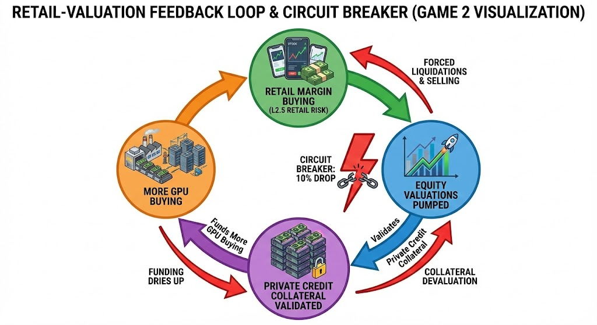
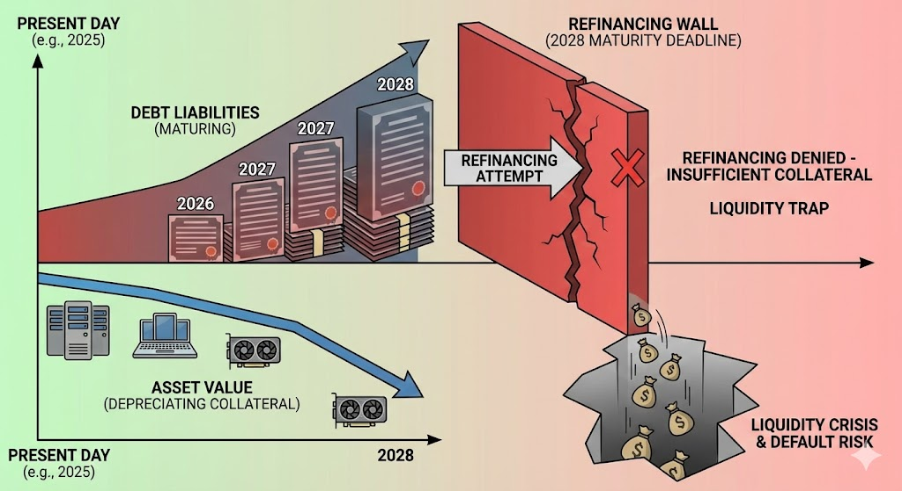
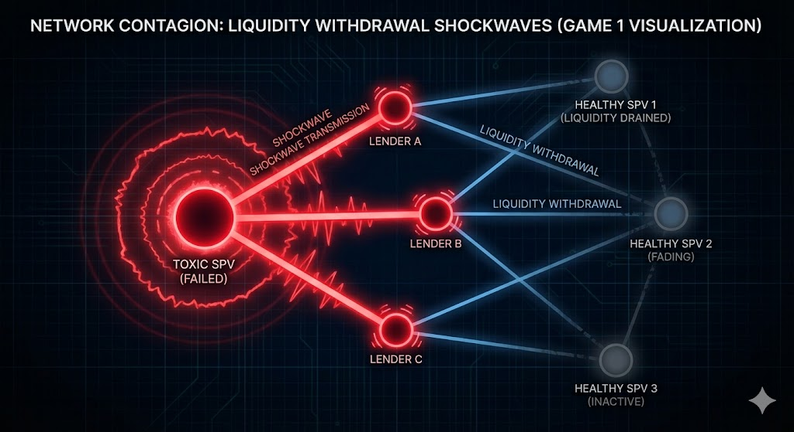
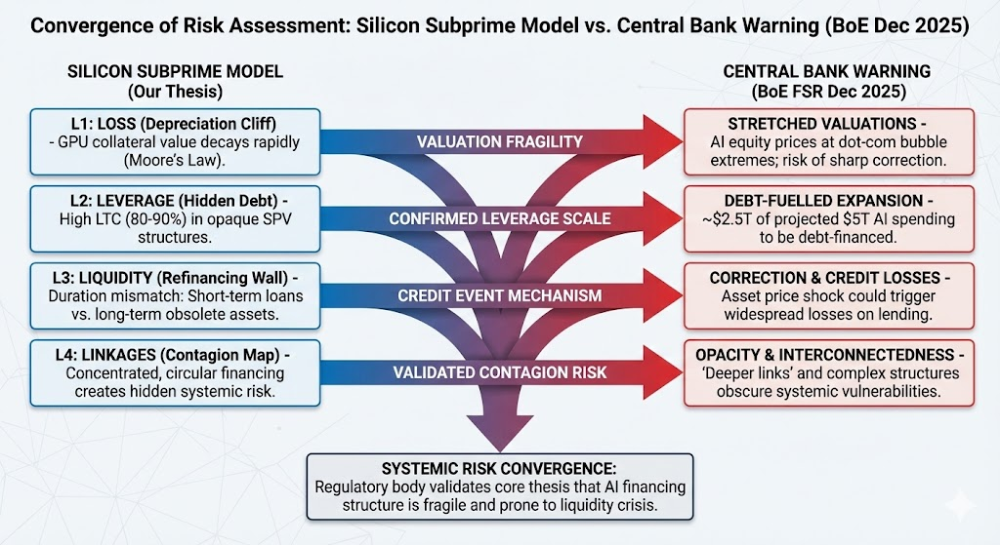

# The Silicon Subprime Thesis: A Systemic Risk Overview

## 1. Introduction: The "Meta-Bubble"
The current AI infrastructure boom is not merely a technology trend; it is a financial phenomenon. We observe a **structural isomorphism** between the 2025 AI "Compute" market and the 2006-2007 Mortgage-Backed Securities (MBS) market.

The core thesis of this repository is that **Duration Mismatch** and **Collateral Depreciation** in the "Shadow Banking" (Private Credit) sector have created a fragile system prone to a liquidity crisis.

---

## 2. The Framework: The "Four Ls" of Systemic Risk
We adapt the IMF/Bisias-Flood-Lo-Valavanis framework to the specific structure of the AI Compute trade.

### **L1: Loss (The Depreciation Cliff)**
In a standard credit model, loss is a probability function of default. In the AI trade, **Loss is a certainty function of Moore's Law.**
* **The Mechanism:** A borrower (SPV) buys an H100 GPU for $25,000. This asset is the *only* collateral for the loan.
* **The Problem:** The release of the Blackwell (B200) chip offers ~4x performance for a similar price. This renders the H100 effectively obsolete for "Training" (premium pricing), relegating it to "Inference" (commodity pricing).
* **The Metric:** If H100 rental rates drop from $4/hr to $2/hr, the *Loss Given Default (LGD)* on the loan rises to >60%, because the liquidation value of the hardware collapses.

### **L2: Leverage (The Hidden Multiplier)**
Leverage in this bubble is not just "Debt/Equity"; it is "Operating Leverage" disguised as "Financial Leverage."
* **The Structure:** "Neoclouds" (e.g., CoreWeave, Lambda) are borrowing at **80-90% Loan-to-Cost (LTC)** via SPVs.
* **The Trick:** They are not borrowing against *corporate* cash flow; they are borrowing against the *projected contract value* of the GPU leases.
* **Systemic Risk:** This is effectively a "Margin Loan" on hardware. If the value of the hardware drops, the lender issues a margin call. But you cannot "top up" a physical data center. You have to sell it.

### **L2.5: Retail Margin (The Valuation Feedback Loop)**
While Private Credit funds the *infrastructure*, Retail Traders fund the *valuation*.
* **The Mechanism:** Retail investors buy AI stocks (e.g., Nvidia, Palantir) using margin debt and options.
* **The Feedback:** High equity valuations act as the "Unsecured Equity Tranche" that justifies the private credit lending. (i.e., "Nvidia is worth $3T, so lending to its customers is safe.")
* **The Risk:** A "Gamma Squeeze" in reverse. If stocks drop >10%, automated broker liquidations force massive selling. This creates a "Wealth Effect" shock that devalues the collateral underpinning the Private Credit deals.

---

---

### **Quantitative Context: The "Shadow Leverage" of 2025**
Unlike 2008, where consumer leverage was visible in mortgage debt, 2025 leverage is hidden in derivatives.
* **0DTE Options:** Zero-Day-To-Expiration options now comprise **~50% of SPX volume**. This effectively allows retail traders to leverage their capital 100x+ for a single day, creating massive "Gamma Risk" for market makers who must hedge these bets.
* **Margin Debt:** While nominal margin debt is high, the *effective* leverage is higher due to the proliferation of "3x Bull" ETFs (e.g., NVDL, SOXL), which embed leverage directly into the equity ticker.

### **L3: Liquidity (The Duration Mismatch)**
The crisis point is the **2028 Refinancing Wall**.
* **Liability Side:** The loans are typically 3-5 year "Private Credit" facilities. They are often **Interest-Only**, meaning the principal ($1B+) is due in a single balloon payment at the end.
* **Asset Side:** By 2028, the H100s will be 4 years old. In semiconductor terms, they are e-waste.
* **The Trap:** No bank will refinance a $1B loan on e-waste. The SPV must pay the balloon with cash it doesn't have. *Liquidity vanishes exactly when it is needed most.*

---

---

### **L4: Linkages (The Contagion Map)**
This is not a random network; it is a **Circular Financing Scheme**.
1.  **Nvidia** invests in **CoreWeave** (Equity).
2.  **CoreWeave** uses that valuation to borrow $7.5B from **Blackstone** (Debt).
3.  **CoreWeave** gives that $7.5B back to **Nvidia** to buy GPUs.
4.  **Nvidia** books this as "Data Center Revenue," boosting its stock price.
5.  **Blackstone** marks the loan as "Performing" because CoreWeave has new assets.

* **The Failure Mode:** If Step 2 stops (Credit Freeze), Step 4 (Nvidia Revenue) collapses, which hurts Step 1 (Valuation), which triggers a default in Step 2.

---

---   

## 3. The Hierarchy of Money & "Shadow Money" Creation
Following the "Money View" (Perry Mehrling), we analyze how this bubble creates "Shadow Money."

### **The "Manufacturing of Safe Assets"**
**Just as the 2008 financial system transformed risky mortgages into "safe" AAA bonds, the 2025 AI complex is attempting to transform volatile GPU hardware into investment-grade collateral.** 
* **The Narrative:** "Compute is the new oil." The market assumes demand for AI training is infinite, making the cash flows from these chips appear secure enough to support leverage.
* **The Reality:** Unlike oil, which is a commodity, H100s are a technology asset that depreciates rapidly.

### **How the Bubble Creates Money**
In this ecosystem, **an AI Loan is treated as Money.**
* **Step 1:** A Private Credit fund takes illiquid pension fund capital and lends it to an SPV.
* **Step 2:** The SPV "pays" Nvidia with this borrowed credit.
* **Step 3:** Nvidia treats this credit as "Cash on Balance Sheet."
* **Step 4:** Nvidia uses that "Cash" to buy share buybacks or acquire other companies.

**The Magic Trick:** The Private Credit fund effectively **monetized the future value of a GPU** that hasn't even been plugged in yet. They turned an *expectation of compute* into *purchasing power today*. This *expands* the effective money supply (elasticity) just as Mortgage-Backed Securities did in 2006.

---

## 4. The Players & The Map
Who is holding the bag?

### **The Lenders (The Shadow Banks)**
* **Blackstone:** Led the $7.5B debt facility for CoreWeave.
* **Blue Owl:** A major player in "ABS" (Asset-Backed Securities) for tech; financed Crusoe Energy.
* **Apollo / Magnetar / PIMCO:** Major private credit funds managing the "Fixed Income" tranches of the AI trade.

### **The Borrowers (The "Neoclouds")**
...
These are the "Subprime" borrowers—companies that exist primarily to hold debt that Microsoft/Google don't want on their own balance sheets.
* **CoreWeave**
* **Lambda Labs**
* **Crusoe Energy**
* **Voltage Park**

### **The Landlords (The Physical Constraint)**
* **QTS / Vantage / Digital Realty:** The entities building the actual concrete shells. They are *also* leveraged. If the Neoclouds default on rent, the Landlords default on their construction loans.

---

## 5. Institutional Validation: The Bank of England Warning (Dec 2025)
The "Silicon Subprime" thesis moved from theoretical concern to regulatory reality with the publication of the **Bank of England's (BoE) Financial Stability Report** in December 2025.

The Financial Policy Committee (FPC) explicitly flagged the AI sector as a primary source of systemic risk, validating three core pillars of our model:

### **Validation A: The Scale of Debt (Bolstering L2)**
The BoE projects that of the estimated **$5 trillion** in AI spending, **"approximately half is expected to be financed externally, mostly through debt."** This confirms that ~$2.5 Trillion of new debt is entering the system on collateral that is subject to rapid depreciation.

### **Validation B: The Valuation/Collateral Loop (Bolstering L2.5)**
The FPC judges that equity valuations are **"materially stretched"** to levels not seen since the Dot-Com Bubble. This validates the "Reflexivity" risk: a sharp correction in equity prices creates a collateral crisis for the debt backing the infrastructure.

### **Validation C: Opacity and Contagion (Bolstering L4)**
The report warns of **"increasing interconnections"** and explicitly cites "opacity" as a weakness. The BoE is worried about exactly what our **Game 1 (The Shadow Book)** simulates: that lenders do not fully understand their co-investors' exposure, creating a hidden contagion vector.

> **"Deeper links between AI firms and credit markets... mean that, should an asset price correction occur, losses on lending could increase financial stability risks."**
> — *Bank of England Financial Stability Report, Dec 2025*

---

---

## 6. Sources & References

* **[Circular Financing: Does Nvidia's $110B Bet Echo the Telecom Bubble?](https://tomtunguz.com/nvidia_nortel_vendor_financing_comparison/)** (Tomasz Tunguz)
* **[The AI Bubble Is Bigger Than You Think](https://prospect.org/2025/11/19/ai-bubble-bigger-than-you-think/)** (The American Prospect)
* **[Nvidia's Circular Cash Flow Explained](https://www.youtube.com/watch?v=gTqvGj13cRM)** (YouTube Analysis)
* **Financial Stability Report** (Bank of England, Dec 2025)

## 7. Theoretical Synergy: Minsky vs. The Four Ls

While this repository focuses on the *mechanics* of a crash, it operates within the broader *psychological* cycle modeled in our companion project, [**Too Big to Teraflop**](https://github.com/roguetrainer/too-big-to-teraflop).

### The Connection: Micro-Foundations of Minsky
Hyman Minsky’s "Financial Instability Hypothesis" argues that stability naturally leads to excess leverage. **Silicon Subprime** provides the mathematical micro-foundations for Minsky’s third and final stage: **Ponzi Finance**.

1.  **Hedge Finance (Safe):** Hyperscalers buying GPUs with cash (2022-2023).
2.  **Speculative Finance (Risky):** Neoclouds borrowing debt to buy GPUs, relying on rental cash flow to pay interest (2024).
3.  **Ponzi Finance (Silicon Subprime):** SPVs borrowing debt where the *principal* can only be repaid by refinancing or selling the asset—both of which are impossible if the asset depreciates.

### The Feedback Loop
* **Too Big to Teraflop** models the **Animal Spirits** that drive capital into the sector.
* **Silicon Subprime** models the **Transmission Mechanism** (Linkages) that turns that capital into systemic fragility.

The "Minsky Moment" occurs when the "Refinancing Wall" (L3) modeled in this repo is hit. The inability to roll over debt forces the fire sales that trigger the macro-collapse.

---

| Feature | Too Big to Teraflop (Minsky) | Silicon Subprime (Four Ls) |
|---------|------------------------------|----------------------------|
| **Player Role** | Central Banker / Macro Manager | Risk Officer / Private Credit Fund |
| **Key Mechanic** | The Three Phases: Moving from Hedge → Speculative → Ponzi finance as the game progresses. | The Waterfall: Watching cash flow dry up before it hits the equity tranche (Game 3) or liquidity contagion (Game 1). |
| **The Villain** | Time & Complacency. The longer you survive, the riskier the market becomes automatically. | Network Topology. You die because someone else (a co-lender) panicked and pulled liquidity. |
| **Winning** | Managing the cycle to soften the landing ("Leaning against the wind"). | Surviving the specific "Refinancing Wall" in 2028 by hoarding cash. |
| **System View** | Top-Down: Looking at aggregate debt levels and animal spirits. | Bottom-Up: Looking at specific balance sheets and bilateral linkages. |

---

## 🧭 Navigation - More on Systemic Risk 🁶 ⤵️ 🁄
[systemic-risk](https://github.com/roguetrainer/systemic-risk) | [systemic-risk-intro](https://github.com/roguetrainer/systemic-risk-intro) | [systemic-risk-metrics](https://github.com/roguetrainer/systemic-risk-metrics) | [silicon-subprime](https://github.com/roguetrainer/silicon-subprime) | [too-big-to-teraflop](https://github.com/roguetrainer/too-big-to-teraflop) | [systemic-risk/docs/](https://github.com/roguetrainer/systemic-risk/blob/main/docs/) {
 [systemic-risk-overview](https://github.com/roguetrainer/systemic-risk/blob/main/docs/systemic-risk-overview.md) | [gpu-financial-complex](https://github.com/roguetrainer/systemic-risk/blob/main/docs/gpu-financial-complex.md)}